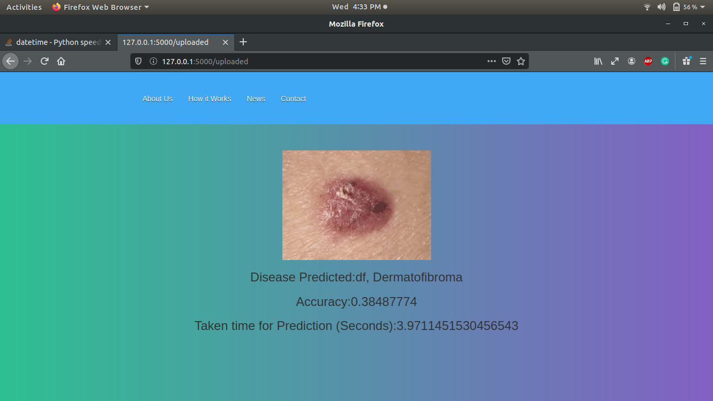
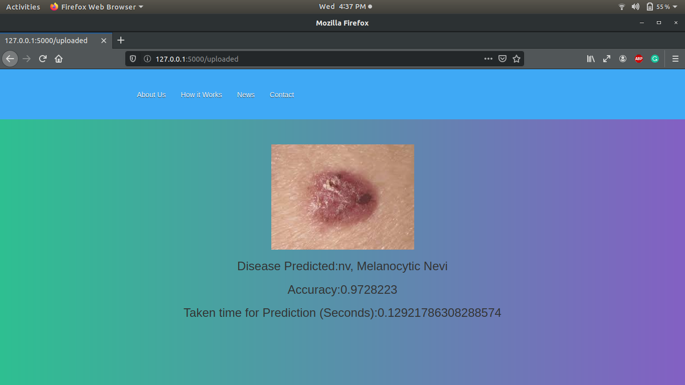

# Skin Disease Detection using AI at the Edge

Skin Disease Detection at edge predicts the disease of skin from the image of that infected part in less than one second and that's where AI at the Edge come.

This web app simply take a disease image using a web interface and give the disease name with accuracy and time taken for prediction.

## Getting Started

### 

## Comparision

Comparision of ***Time taken for prediction*** Skin disease detection at edge with normal skin disease detection system (https://github.com/denilDG/skin-disease-detection).

#### Skin Disease Detection using tensorflow weight files
   

##### Skin Disease Detection at edge
   

## Note:

### This model is not that much accurate. It's only for leaning the deployment of an web app using openvino and flask. 
